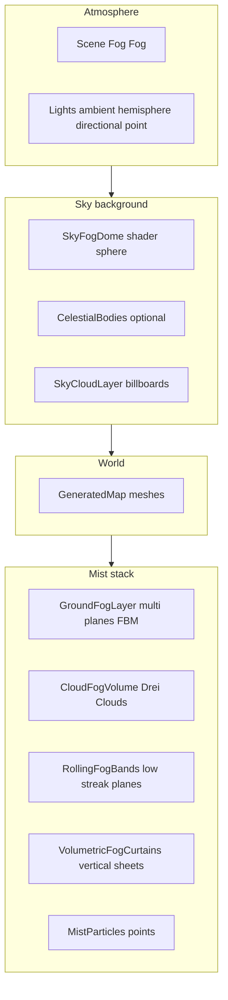

# Post-mortem: Layered mist, volumetric haze, and sky integration (Web / React Three Fiber)

**Project:** EchoesOfAethon (`apps/web`)  
**Branch (feature work):** `feature/volumetric-mist-lantern`  
**Companion artifacts:** [`mist-iteration-atlas.html`](mist-iteration-atlas.html) (visual atlas), this file (full technical post-mortem)  
**Date:** 2026-05-22  

---

## How to use this document

This is a **replayable engineering log** for anyone (including future you) who hits the same wall: *“We tried volumetric fog / particles / Drei clouds and it either disappeared, turned into white soup, killed the frame rate, or ignored the player.”*  

Skim **§2 Executive summary** and **§9 Scene fog vs shader fog** first. When debugging live, use **§14 Debug playbook** and the HTML atlas’s toggle table.

---

## 1. Executive summary

### What we shipped

A **staged compositing stack** of mostly **transparent, unlit or self-lit** layers that together read as **ground-hugging mist**, **rolling cloud banks**, **optional vertical haze curtains**, **fine grain particles**, **Drei volumetric-style clouds**, a **shader sky dome**, and **sky billboard clouds**—all tuned for a **short-range scene fog** (`Fog` with `near ≈ 4`, `far ≈ 13`) so the world stays readable while distant silhouettes stay moody.

### The single most important lesson

**Three.js `Fog` multiplies into many materials by default.** Anything you place “at infinity” or tens–hundreds of units away will be **tinted toward fog color** unless the material opts out with **`fog: false`**. That one flag (plus `toneMapped: false` where you want art-direct color) is the difference between *“my emissive sky body vanished”* and *“it reads as designed.”*

### Why we did *not* rely on one technique

- **True volumetrics** (3D textures, raymarching, N8Fog, post fog) trade **GPU cost** and **integration complexity** for a single unified medium. For a prototype map with many transparent layers, we preferred **predictable art direction** and **per-layer kill switches**.
- **Particles alone** either look like **billboard confetti** (high alpha / large points) or are **invisible** (tiny alpha / dense counts). We combined **large soft planes** (cheap) with **sparse points** (texture).
- **Drei `<Cloud>`** gives **shape** quickly but is another **render-order and blending** participant; it must be **explicitly ordered** relative to floor fog.

---

## 2. Goals, non-goals, and acceptance criteria

### Goals

1. **Readable floor** near the player: not a solid white card, not a hollow “air bubble” that breaks mood.
2. **Sense of depth**: horizon and mid-air haze that **scatters** toward existing lights (e.g. pink lantern / gate glow).
3. **Controllable iteration**: toggles per subsystem, deterministic scatter where possible.
4. **Ship on web** with **React Three Fiber** + **three.js** without native-only extensions.

### Non-goals (for this iteration)

1. Physically correct **atmospheric scattering** or **height fog** tied to sun direction (we fake with gradients and tints).
2. **Shadow-casting fog** (fog does not occlude light in the lighting model the way smoke volumes would).
3. **Single-pass volumetric solution** optimized to production AAA quality.

### Acceptance signals we used

- Fog reads as **low haze** along the deck, not **opaque slabs** (commit message history explicitly calls out the “white blobs” failure mode and the later “low haze” target).
- Player retains **minimum fog density** near feet (`minimumFogNearPlayer` ≈ 0.82–0.85 on sheets) so we avoid a **VR-style comfort cutout** while still preserving **silhouette**.
- **Frame time** remains acceptable on a typical dev laptop at prototype map size (qualitative; no formal perf budget in-repo).

---

## 3. Repository map (files you will touch again)

| Area | Path |
|------|------|
| Scene assembly | `apps/web/src/scenes/PrototypeScene.tsx` |
| Atmosphere + **scene fog** | `apps/web/src/rendering/Atmosphere.tsx`, `apps/web/src/rendering/atmosphereConfig.ts` |
| Sky dome | `apps/web/src/rendering/SkyFogDome.tsx` |
| Mist / fog | `apps/web/src/rendering/mist/*.tsx`, `apps/web/src/rendering/mist/*Config.ts` |
| Sky clouds (non-Drei) | `apps/web/src/rendering/sky/SkyCloudLayer.tsx`, `skyCloudConfig.ts` |
| Seeded scatter | `apps/web/src/features/map-generation/data/seededRandom.ts` |
| Web dependencies | `apps/web/package.json` |

---

## 4. Dependencies and packages

### Installed packages (relevant subset)

From `apps/web/package.json` at the time of this writing:

| Package | Role in mist work |
|---------|-------------------|
| `three` | Core WebGL renderer, `Fog`, `ShaderMaterial`, `BufferGeometry`, `Points`, lights |
| `@react-three/fiber` | Scene graph in React, `useFrame`, lifecycle |
| `@react-three/drei` | **`<Clouds>` / `<Cloud>`** for `CloudFogVolume` procedural volumetric-ish sprites |

No separate post-processing fog (e.g. `postprocessing` npm package) was added for this stack—the look is **in-scene geometry + shaders**.

### Why Drei clouds

`CloudFogVolume.tsx` uses:

```tsx
<Clouds material={THREE.MeshBasicMaterial} renderOrder={5}>
```

**Reasoning:**

- `<Cloud>` builds **many soft billboards** inside a bounded volume—fast to iterate compared to hand-placing hundreds of quads.
- **`MeshBasicMaterial`** ignores scene lighting so clouds keep **art-direct color** under our dark ambient + short fog. Lit clouds would go muddy or swing wildly with directional lights.
- **`renderOrder={5}`** pulls the volume **after** most mist layers (see §6) so it **reads in front** of floor sheets where desired.

---

## 5. Architecture: layer stack and data flow

### 5.1 Conceptual diagram



### 5.2 Uniform / state flow (every frame)

1. **`useFrame`** reads **`playerPosition`** from `usePlayerStore` (Zustand).
2. **Lantern position** is reconstructed from player position + **camera yaw** (`useCameraStore`) and a **fixed local offset** vector (same pattern in `GroundFogLayer` and `MistParticles`).
3. **Shader uniforms** update: `uTime`, `uPlayerPosition`, `uLanternPosition`, optional visibility multiplier (`forceHighVisibility`).

This keeps **pockets** and **tints** tied to the **actual avatar**, not a static world origin.

---

## 6. Render order and draw order (critical for transparency)

Transparent meshes in three.js are sorted; **`renderOrder`** forces a stable priority among co-transparent objects.

**Observed `renderOrder` values (approximate back → front in this project):**

| Component | `renderOrder` | Notes |
|-----------|---------------|-------|
| `SkyFogDome` | `-100` | Drawn first; `depthTest: false` |
| `CelestialBodies` | `-90` … `-87` | Billboards + meshes; many materials `fog: false` |
| `SkyCloudLayer` | `-50` | Many quads; `depthTest: false` on material |
| `GroundFogLayer` | `-3` | Floor sheets |
| `VolumetricFogCurtains` / `RollingFogBands` | `-2` | Vertical / low streaks |
| `CloudFogVolume` (`<Clouds>`) | `5` | Pulled forward |

**Rule of thumb:** When a layer “disappeared behind” another, we first checked **`renderOrder`**, then **`depthWrite` / `depthTest`**, then **scene fog**.

---

## 7. Scene fog (`Fog`) — the invisible foot-gun

### Configuration

`ATMOSPHERE_CONFIG.fog` in `atmosphereConfig.ts`:

- **`near: 4`**, **`far: 13`** (very tight!)
- Fog color roughly matches the night palette.

### Effect on materials

For materials with **`fog: true` (default)**:

- Any fragment whose world distance falls in the fog ramp gets **mixed toward fog color**.
- At distances **≫ `far`**, the object is essentially **fully fog-colored**.

### Why sky / mist shaders disable fog

All custom mist shaders set:

- **`fog: false`** on `ShaderMaterial`
- Many also **`toneMapped: false`** for predictable color in HDR pipeline

**Symptom we avoided in mist; symptom that hit celestials earlier:** emissive `MeshStandardMaterial` on distant objects looked **unlit** because **emissive was still fog-scaled**—fix was **`fog: false`** on those materials too.

**Takeaway for other projects:** If you use aggressive `Fog` for gameplay readability, **every decorative sky element** (moon, nebula planes, god rays) needs an explicit decision: **participate in fog** (depth cue) or **opt out** (readable hero silhouette).

---

## 8. Layer-by-layer technical breakdown

### 8.1 `SkyFogDome`

**File:** `apps/web/src/rendering/SkyFogDome.tsx`

**Geometry:** Scaled sphere (`scale` roughly `[220, 70, 220]`, translated above map center).

**Material:** Custom `ShaderMaterial`, **`side: BackSide`**, **`depthTest: false`**, **`depthWrite: false`**, **`fog: false`**.

**Fragment logic (conceptual):**

- Derive height from **world normal** `y` component (dome normal ≈ direction on sphere).
- **Trilinear-ish blend** between `topColor`, `midColor`, `horizonColor` using `smoothstep` windows.
- Tiny **horizon shimmer**: `0.012 * sin(uTime * 0.14 + vWorldNormal.x * 4.8)`.

**Why depth test off:** The dome is **backdrop**; you do not want the map’s depth buffer to punch holes in the sky.

---

### 8.2 `GroundFogLayer` — primary floor coverage

**Files:** `GroundFogLayer.tsx`, `groundFogConfig.ts`

**Geometry:** Single shared **`PlaneGeometry(width, depth)`** per layer instance, rotated **`rotation.x = -π/2`** (horizontal), stacked at small **`y`** offsets (e.g. `0.035`, `0.12`, `0.28`).

**Material:** `ShaderMaterial`, **`depthWrite: false`**, **`depthTest: true`**, **`toneMapped: false`**, **`fog: false`**, **`DoubleSide`**.

#### Noise core (value noise + FBM)

**Value noise** on integer lattice:

1. `hash(vec2 p)` → pseudo-random `[0,1)`.
2. `noise(vec2 p)` → bilinear blend of four corners with **smoothstep interpolation** (Hermite `f*f*(3-2f)`).

**FBM** (4 octaves):

\[
\text{fbm}(p) = \sum_{i=0}^{3} a_i \cdot \text{noise}(p_i),\quad p_{i+1} = 2 p_i,\quad a_{i+1} = 0.5 a_i,\quad a_0 = 0.5
\]

**Ground composition:**

- Three scaled / scrolled FBMs `n1`, `n2`, `n3` at world XZ scales `0.055`, `0.13`, `0.31` with different time phases.
- Combined: `cloud = 0.62*n1 + 0.28*n2 + 0.10*n3`.
- Contrast: `cloud = smoothstep(0.34, 0.68, cloud)`.

**Height density along world `y`:**

```glsl
heightDensity = 1.0 - smoothstep(0.0, 1.05, vWorldPosition.y);
heightDensity = pow(max(heightDensity, 0.0), 0.38);
```

Interpretation: densest at ground; **power `0.38`** lifts mid-height values (shallower falloff than linear before clamp).

#### Player / lantern “pocket” (not a boolean hole)

Radial distance on **XZ**:

\[
\text{pocket}(d) = \text{mix}(\rho_{\min}, 1.0, \text{smoothstep}(R, R+S, d))
\]

where:

- `R` = `uClearRadius` (player) or lantern radius
- `S` = softness
- \(\rho_{\min}\) = `minimumFogNearPlayer` (e.g. `0.82`)

Two pockets combine with **`max(playerPocket, lanternPocket)`** so either influence can dominate.

**Lantern tint (scatter hack):**

```glsl
localGlow = 1.0 - smoothstep(0.0, 4.5, distToPlayer);
localGlow = pow(localGlow, 2.0);
fogColor = mix(uColor, glowColor, localGlow * 0.55);
```

This is **not** physics—it is **view-adjacent color grading** that sells “light in fog.”

#### Edge fade

UV-based `smoothstep` rim so the rectangular plane boundary is invisible.

#### Alpha composition

\[
\alpha = \alpha_u \cdot \text{cloud} \cdot \text{heightDensity} \cdot \text{pocketClear} \cdot \text{edgeFade}
\]

**Early discard:** `if (alpha < 0.003) discard;` reduces overdraw cost.

---

### 8.3 `CloudFogVolume` (Drei)

**Files:** `CloudFogVolume.tsx`, `cloudFogConfig.ts`

**API:** Nested `<Clouds>` → multiple `<Cloud>` children with props: `bounds`, `volume`, `opacity`, `speed`, `growth`, `segments`, `fade`, `seed`.

**Seeding pattern:** `seed={CLOUD_FOG_CONFIG.seed + index * 17}` to decorrelate layers while staying deterministic.

**Failure modes:**

- **`opacity` too high** + many segments → “cotton wall.” Mitigate with fewer `volume` / lower `opacity` / taller `boundsHeight` spread.
- **Wrong `renderOrder`** → clouds float under floor fog or z-fight. Fix by moving `<Clouds>` in JSX tree *and* `renderOrder`.

---

### 8.4 `RollingFogBands`

**Files:** `RollingFogBands.tsx`, `rollingFogBandsConfig.ts`

**Concept:** Many **wide, shallow planes** (actually XZ-oriented quads with `rotation.x = -π/2`) at low `y`, each with its own FBM parameters, **drifting** via `useFrame` updating group position:

```ts
g.position.x = spec.baseX + Math.sin(t * drift.speed + phase) * drift.amplitude
g.position.z = spec.baseZ + Math.cos(t * drift.speed * 0.7 + phase) * drift.amplitude * 0.7
```

**Why it reads as “rolling banks”:** stacking **moderate alpha** (`alpha.min/max` higher than curtains) + **anisotropic world noise** + **slow drift**.

**Lan scatter:** same family as ground fog (`mix` toward magenta-ish `glowColor`).

---

### 8.5 `VolumetricFogCurtains`

**Files:** `VolumetricFogCurtains.tsx`, `volumetricFogConfig.ts`

**Concept:** **Vertical planes** (`PlaneGeometry` upright), **very low alpha** (`0.004`–`0.012` range in config) so individual quads **never read as rectangles**—only their ensemble suggests volume.

**Noise:** 2-layer FBM mix + `smoothstep(0.42, 0.72, n)`.

**Vertical shaping:**

- `heightFade` from world `y` (`1.0 - smoothstep(0, 3.5, y)`).
- UV fades on top/bottom and sides.

**Drift:** same sine/cos pattern as bands but with config `drift.speed` / `amplitude`.

---

### 8.6 `MistParticles`

**Files:** `MistParticles.tsx`, `mistParticleConfig.ts`

**Geometry:** `BufferGeometry` with `count` points (ship mode `18000`), positions seeded in padded map AABB, attributes `aSize`, `aPhase`.

**Vertex motion (wind):**

```glsl
pos.x += sin(uTime * WS + aPhase) * STR;
pos.z += cos(uTime * WS*0.8 + aPhase) * STR;
```

(`WS` / `STR` inlined from config at shader compile time.)

**Point size (perspective hack):**

```glsl
gl_PointSize = aSize * (12.0 / max(-mvPosition.z, 3.0));
gl_PointSize = clamp(gl_PointSize, 0.8, 4.0);
```

**Fragment:** circular alpha via `gl_PointCoord` distance to center; pockets mirror ground fog.

**`MIST_DEBUG` flag:** When `true`, **far fewer particles** but **huge sizes and high alpha** so you can see one wisp clearly. This pattern saved hours: **never tune 18k points blind**.

**Known sharp edge:** `depthTest = !MIST_PARTICLE_CONFIG.debug`—debug disables depth test to guarantee visibility over terrain.

---

### 8.7 `SkyCloudLayer` (shader billboards)

**File:** `SkyCloudLayer.tsx`

**Note:** Uses **5-octave FBM** (one more than mist sheets) and **UV edge window**; `depthTest: false` so clouds do not leave holes in the sky stack.

---

## 9. Deterministic randomness (`createSeededRandom`)

**File:** `seededRandom.ts`

- String seed → **FNV-1a style** `hashStringToUint32`
- **`mulberry32`** PRNG
- API: `range`, `int`, **`bool`**, `pick`, `shuffle`

### Production bug class: `rng.boolean` vs `rng.bool`

TypeScript API exposes **`bool`**, not `boolean`. A mist iteration briefly used the wrong name; TypeScript would error (or a runtime undefined call if compiled loosely). **Always align helper names with the actual export** when merging AI-generated code.

---

## 10. Git archaeology (what the commit titles tell us)

On `feature/volumetric-mist-lantern`, recent history includes:

1. **`fix(web): mist reads as low haze—not white blobs`** — documents the dominant failure: **over-opaque** or **wrong-scale noise** reads as **floating geometry**, not atmosphere.
2. **`fix(web): rebuild mist as staged floor haze (debug-first)`** — pivot to **layered sheets + toggles** before polishing art.
3. **`feat(web): add layered ground fog with lantern pocket`** — introduces **dual pocket** (player + lantern) and **local tint**.
4. **`feat(web): layered fog stack with Drei clouds and sky dome`** — integration milestone: **Drei + dome + ordering**.

Use these as **mental milestones** when bisecting regressions.

---

## 11. Failure modes → diagnosis → fix (table)

| Symptom | Likely cause | Fix |
|---------|--------------|-----|
| Entire screen milky white | Alpha stacking + high `opacity` on multiple full-screen-sized planes | Lower per-layer alpha; reduce overlap; use `discard` thresholds |
| Fog only in a corner | Plane not centered on map bounds; wrong `centerX/centerZ` | Recompute bounds + padding |
| “Swiss cheese” near player | `minimumFogNearPlayer` too low | Raise toward `0.8+` |
| Player always in opaque tube | `clearRadius` too small / softness too low | Increase softness first |
| Distant emissive body invisible | Scene `Fog` + material `fog: true` | `fog: false` + revisit `toneMapped` |
| Drei clouds vanish | `renderOrder` behind other transparent mass | Raise `renderOrder` or move JSX later |
| Particles invisible | `alpha` tiny + `depthTest` occluded by floor | Enable debug profile; temporarily raise `alpha.base` |
| Moire / shimmer bands | FBM scale resonates with plane verts | Change world scale constants slightly; add temporal phase |

---

## 12. Performance notes (practical, not benchmarked)

1. **`discard`** early in fog shaders saves fill on empty fragments.
2. **Shared `PlaneGeometry`** in `GroundFogLayer` avoids duplicating large meshes in memory.
3. **`Cloud` segment counts** (`segments: 48` etc.) dominate Drei cost—treat as primary knob.
4. **18k points** is fine on many GPUs but watch **mobile**; reduce `count` or use instancing later.

---

## 13. If you restart this in another repo (checklist)

1. **Decide fog strategy:** `Fog` ranges vs none vs post fog vs height-based shader on camera.
2. **Tag materials:** For every sky/decorative shader, explicitly set **`fog`** and **`toneMapped`**.
3. **Establish `renderOrder` ladder** on day one (spread values: −100, −50, −10, 0, +10).
4. **Build ground sheets first** with **world-space noise** (not UV-only) so resizing the map does not rescale the look.
5. **Add pockets second** using smooth radial ramps, not booleans.
6. **Add Drei clouds last** (they’re the least predictable in draw order).
7. **Particles last**—they hide problems if tuned too high.

---

## 14. Debug playbook (order of operations)

1. Set **`forceHighVisibility`** flags in configs (if present) to confirm the layer exists.
2. Flip **`showGroundFog` / `showRollingBands` / `showFogCurtains` / `showParticles`** one at a time.
3. Temporarily set **`MIST_DEBUG = true`** in `mistParticleConfig.ts` for particle visibility.
4. In DevTools or on-screen HUD (if wired), print **active layer toggles**—`getMistHudLines()` exists for that purpose.
5. If color is wrong, check **`toneMapped`** and **`fog`** before touching noise.

---

## 15. Related work outside `rendering/mist/` (same iteration family)

- **`SkyFogDome`**, **`SkyCloudLayer`**, **`CelestialBodies`** share the same **atmospheric composition** problems (ordering + fog). Documenting them here avoids repeating the fog lecture in three places.

---

## 16. Open follow-ups (optional hardening)

1. **Centralize render order constants** in one `rendering/renderOrder.ts` to avoid magic numbers drifting.
2. **Distance-based LOD**: disable curtains/particles when camera is above a height threshold.
3. **Replace magic lantern vector** with an actual attachment node from the player rig once the lantern mesh exists.
4. **Automated screenshot tests** for fog regression (hard but valuable).

---

## 17. Appendix: key uniform list (ground fog)

| Uniform | Role |
|---------|------|
| `uTime` | Animate noise offsets |
| `uColor` | Base fog dye |
| `uPlayerPosition` | Pocket + tint distances |
| `uLanternPosition` | Secondary pocket |
| `uAlpha` | Layer strength |
| `uNoiseScale` / `uNoiseSpeed` | Per-layer tuning hooks (currently driven from config) |
| `uClearRadius` / `uClearSoftness` | Player pocket |
| `uLanternClearRadius` / `uLanternClearSoftness` | Lantern pocket |
| `uMinimumFogNearPlayer` | Floor alpha floor |
| `uEdgeFade` | UV rim |

---

**End of post-mortem.** For a lighter visual pass, open [`mist-iteration-atlas.html`](mist-iteration-atlas.html).
